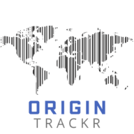

# OriginTrackr - Find out where your product choices are coming from using your camera




A modern web application to help you better identify where products come from during your errands! It lets you scan the barcodes on products using your cell phone camera and then uses the UPC to tell you where the product is coming from. It does this entirely offline- you can visit this page while you have internet and then re-visit the page while avoidng spotty or non-existant supermarket internet and still be able to see where your products are coming from!

## Overview

Built with modern web technologies and featuring Kendo UI Free Components, OriginTrackr provides a robust and user-friendly interface.

## Technologies

- Frontend: React 
- UI Components: Kendo UI Free Components

## Features

- Barcode scanning
- UPC lookup by country
- Offline-capable
- Allows users to store scans they would like to remember to a handy data table. Items in this table are stored locally in the user's browser.

## Development Setup

1. Clone the repository
2. Install dependencies:
```bash
npm install
```
3. Start the development server:
```bash
npm start
```

## Contributing

1. Fork the repository
2. Create a feature branch
3. Submit a pull request

## License

MIT License

## Note

This project utilizes Kendo UI Free Components. Please ensure compliance with Progress® Kendo UI® licensing terms when contributing or deploying.
